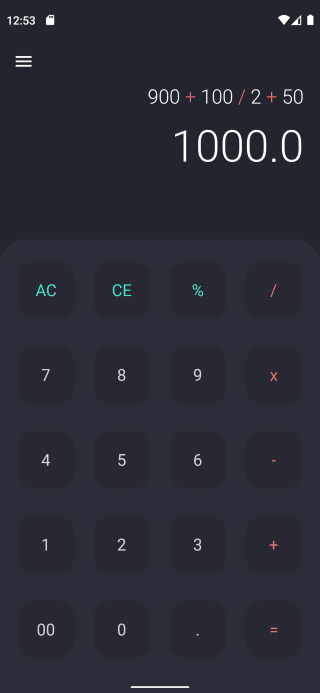
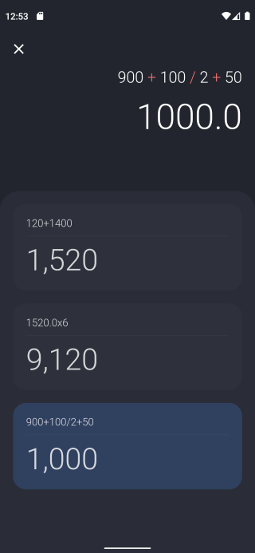

# Flutter Calculator

Calculator project created with Flutter framework.

## Screenshots

# Libraries used

- MathExpressions 2.3.0
- Intl 0.17.0

# Links

- [Asensive (WebSite)](https://asensive.com/)
- [Instagram](https://www.instagram.com/mohammadshateri.dev/)
- [Linkedin](https://www.linkedin.com/in/mohammadshateri/)
- [Dribbble](https://dribbble.com/mohammadshateri)